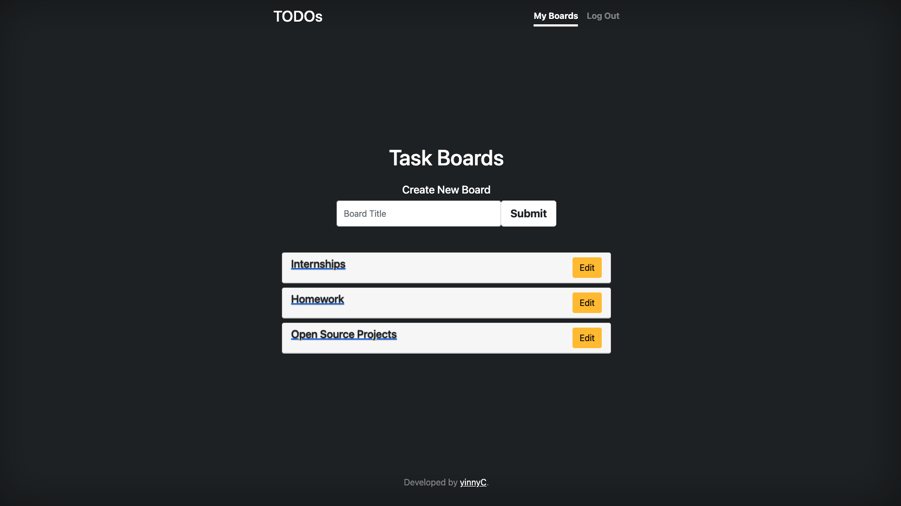

# ToDos App

An ToDos App for users to create Taskboard and keep track of the tasks.

Check out the website -> [link](https://flask-todolist-web-app.herokuapp.com/)



## Instruction

To run this code, start by cloning this repository to your computer. Then in a terminal, navigate to the project folder.

To install dependencies, run:

```Terminal Command
pip3 install -r requirements.txt
```

Then rename the `.env.example` file as `.env`:

```Terminal Command
cp .env.example .env
```

Then you can run the server in the docker container with the commands below:

```Terminal Command
docker build -t flask-image .
docker run -p 5000:5000 --rm --name 
```
